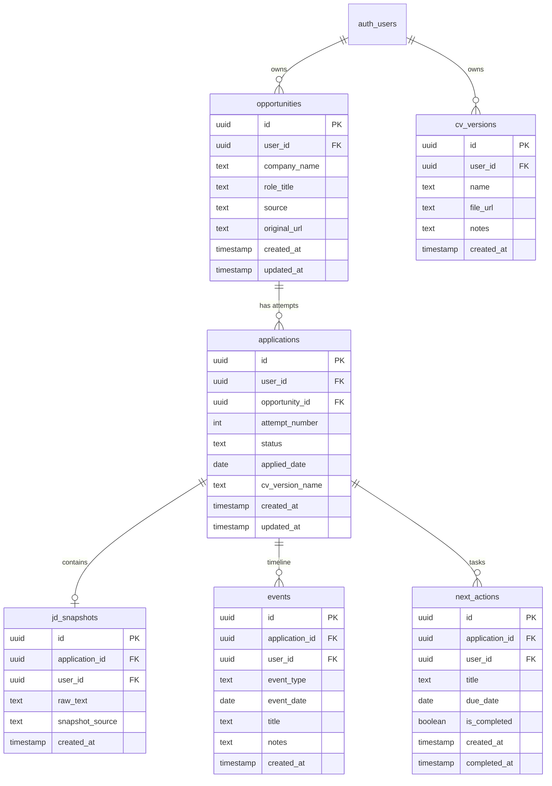

# Đặc tả Dữ liệu và Schema

Tài liệu này là hợp đồng dữ liệu duy nhất giữa Supabase PostgreSQL, Shared Zod Validation, Web App và Browser Extension.

---

## 1. Sơ đồ quan hệ thực thể (ERD)



---

## 2. PostgreSQL DDL cho Supabase

```sql
-- Kích hoạt extension sinh UUID
CREATE EXTENSION IF NOT EXISTS "uuid-ossp";

-- 1. BẢNG OPPORTUNITIES
CREATE TABLE public.opportunities (
    id UUID PRIMARY KEY DEFAULT uuid_generate_v4(),
    user_id UUID NOT NULL REFERENCES auth.users(id) ON DELETE CASCADE,
    company_name TEXT NOT NULL,
    role_title TEXT NOT NULL,
    source TEXT DEFAULT 'direct', -- 'linkedin', 'topcv', 'itviec', 'facebook', 'referral', etc.
    original_url TEXT,
    created_at TIMESTAMPTZ NOT NULL DEFAULT timezone('utc'::text, now()),
    updated_at TIMESTAMPTZ NOT NULL DEFAULT timezone('utc'::text, now())
);

-- 2. BẢNG APPLICATIONS
CREATE TYPE public.application_status AS ENUM (
    'saved',          -- Mới lưu, chưa nộp
    'applied',        -- Đã nộp hồ sơ
    'interviewing',   -- Đang trong các vòng phỏng vấn hoặc test
    'offered',        -- Nhận được offer
    'rejected',       -- Bị từ chối
    'withdrawn',      -- Ứng viên chủ động rút lui
    'closed'          -- Đóng hồ sơ do không phản hồi hoặc vị trí bị hủy
);

CREATE TABLE public.applications (
    id UUID PRIMARY KEY DEFAULT uuid_generate_v4(),
    user_id UUID NOT NULL REFERENCES auth.users(id) ON DELETE CASCADE,
    opportunity_id UUID NOT NULL REFERENCES public.opportunities(id) ON DELETE CASCADE,
    attempt_number INT NOT NULL DEFAULT 1,
    status public.application_status NOT NULL DEFAULT 'saved',
    applied_date DATE,
    cv_version_name TEXT, -- Ví dụ: 'backend-v2', 'fresher-general'
    created_at TIMESTAMPTZ NOT NULL DEFAULT timezone('utc'::text, now()),
    updated_at TIMESTAMPTZ NOT NULL DEFAULT timezone('utc'::text, now()),
    UNIQUE (opportunity_id, attempt_number)
);

-- 3. BẢNG JD_SNAPSHOTS
CREATE TABLE public.jd_snapshots (
    id UUID PRIMARY KEY DEFAULT uuid_generate_v4(),
    application_id UUID NOT NULL REFERENCES public.applications(id) ON DELETE CASCADE,
    user_id UUID NOT NULL REFERENCES auth.users(id) ON DELETE CASCADE,
    raw_text TEXT NOT NULL,
    snapshot_source TEXT DEFAULT 'extension', -- 'extension', 'paste', 'manual'
    created_at TIMESTAMPTZ NOT NULL DEFAULT timezone('utc'::text, now()),
    UNIQUE(application_id)
);

-- 4. BẢNG EVENTS
CREATE TYPE public.event_type AS ENUM (
    'applied',
    'hr_screen',
    'technical_test',
    'tech_interview',
    'culture_interview',
    'final_interview',
    'offer_received',
    'rejected',
    'custom'
);

CREATE TABLE public.events (
    id UUID PRIMARY KEY DEFAULT uuid_generate_v4(),
    application_id UUID NOT NULL REFERENCES public.applications(id) ON DELETE CASCADE,
    user_id UUID NOT NULL REFERENCES auth.users(id) ON DELETE CASCADE,
    event_type public.event_type NOT NULL DEFAULT 'custom',
    event_date DATE NOT NULL DEFAULT CURRENT_DATE,
    title TEXT NOT NULL,
    notes TEXT,
    created_at TIMESTAMPTZ NOT NULL DEFAULT timezone('utc'::text, now())
);

-- 5. BẢNG NEXT_ACTIONS
CREATE TABLE public.next_actions (
    id UUID PRIMARY KEY DEFAULT uuid_generate_v4(),
    application_id UUID NOT NULL REFERENCES public.applications(id) ON DELETE CASCADE,
    user_id UUID NOT NULL REFERENCES auth.users(id) ON DELETE CASCADE,
    title TEXT NOT NULL,
    due_date DATE,
    is_completed BOOLEAN NOT NULL DEFAULT FALSE,
    created_at TIMESTAMPTZ NOT NULL DEFAULT timezone('utc'::text, now()),
    completed_at TIMESTAMPTZ
);

-- 6. BẢNG CV_VERSIONS
CREATE TABLE public.cv_versions (
    id UUID PRIMARY KEY DEFAULT uuid_generate_v4(),
    user_id UUID NOT NULL REFERENCES auth.users(id) ON DELETE CASCADE,
    name TEXT NOT NULL,
    file_url TEXT,
    notes TEXT,
    created_at TIMESTAMPTZ NOT NULL DEFAULT timezone('utc'::text, now()),
    UNIQUE(user_id, name)
);

-- TẠO INDEXES TỐI ƯU TRUY VẤN
CREATE INDEX idx_opportunities_user ON public.opportunities(user_id);
CREATE INDEX idx_applications_user_status ON public.applications(user_id, status);
CREATE INDEX idx_applications_opp_id ON public.applications(opportunity_id);
CREATE INDEX idx_events_app_id ON public.events(application_id);
CREATE INDEX idx_next_actions_user_due ON public.next_actions(user_id, due_date) WHERE is_completed = FALSE;

---

## 3. Chính sách Row Level Security (RLS)

Mọi bảng đều phải bật RLS. Người dùng chỉ có quyền Xem, Thêm, Sửa, Xóa dữ liệu của chính mình (`auth.uid() = user_id`).

```sql
-- Kích hoạt RLS
ALTER TABLE public.opportunities ENABLE ROW LEVEL SECURITY;
ALTER TABLE public.applications ENABLE ROW LEVEL SECURITY;
ALTER TABLE public.jd_snapshots ENABLE ROW LEVEL SECURITY;
ALTER TABLE public.events ENABLE ROW LEVEL SECURITY;
ALTER TABLE public.next_actions ENABLE ROW LEVEL SECURITY;
ALTER TABLE public.cv_versions ENABLE ROW LEVEL SECURITY;

-- 1. Policies cho opportunities
CREATE POLICY "Users can manage their own opportunities"
ON public.opportunities FOR ALL
USING (auth.uid() = user_id)
WITH CHECK (auth.uid() = user_id);

-- 2. Policies cho applications
CREATE POLICY "Users can manage their own applications"
ON public.applications FOR ALL
USING (auth.uid() = user_id)
WITH CHECK (auth.uid() = user_id);

-- 3. Policies cho jd_snapshots
CREATE POLICY "Users can manage their own jd_snapshots"
ON public.jd_snapshots FOR ALL
USING (auth.uid() = user_id)
WITH CHECK (auth.uid() = user_id);

-- 4. Policies cho events
CREATE POLICY "Users can manage their own events"
ON public.events FOR ALL
USING (auth.uid() = user_id)
WITH CHECK (auth.uid() = user_id);

-- 5. Policies cho next_actions
CREATE POLICY "Users can manage their own next_actions"
ON public.next_actions FOR ALL
USING (auth.uid() = user_id)
WITH CHECK (auth.uid() = user_id);

-- 6. Policies cho cv_versions
CREATE POLICY "Users can manage their own cv_versions"
ON public.cv_versions FOR ALL
USING (auth.uid() = user_id)
WITH CHECK (auth.uid() = user_id);
```

---

## 4. Shared Zod Schemas (`packages/shared/src/schemas/`)

Được dùng chung cho cả Web App, Extension và API handlers:

```typescript
import { z } from 'zod';

// Application Status Enum
export const ApplicationStatusSchema = z.enum([
  'saved',
  'applied',
  'interviewing',
  'offered',
  'rejected',
  'withdrawn',
  'closed',
]);
export type ApplicationStatus = z.infer<typeof ApplicationStatusSchema>;

// Event Type Enum
export const EventTypeSchema = z.enum([
  'applied',
  'hr_screen',
  'technical_test',
  'tech_interview',
  'culture_interview',
  'final_interview',
  'offer_received',
  'rejected',
  'custom',
]);
export type EventType = z.infer<typeof EventTypeSchema>;

// 1. Fast Capture DTO
export const FastCaptureSchema = z.object({
  company_name: z.string().min(1, 'Tên công ty không được để trống'),
  role_title: z.string().min(1, 'Vị trí ứng tuyển không được để trống'),
  source: z.string().default('direct'),
  original_url: z.string().url().optional().or(z.literal('')),
  raw_jd_text: z.string().min(10, 'Nội dung JD tối thiểu 10 ký tự'),
  cv_version_name: z.string().optional(),
  status: ApplicationStatusSchema.default('saved'),
});
export type FastCaptureInput = z.infer<typeof FastCaptureSchema>;

// 2. Next Action DTO
export const NextActionSchema = z.object({
  id: z.string().uuid().optional(),
  application_id: z.string().uuid(),
  title: z.string().min(1, 'Nội dung hành động không được để trống'),
  due_date: z.string().optional(), // YYYY-MM-DD
  is_completed: z.boolean().default(false),
});
export type NextAction = z.infer<typeof NextActionSchema>;

// 3. Event DTO (Timeline)
export const EventSchema = z.object({
  id: z.string().uuid().optional(),
  application_id: z.string().uuid(),
  event_type: EventTypeSchema,
  event_date: z.string(), // YYYY-MM-DD
  title: z.string().min(1, 'Tiêu đề sự kiện không được để trống'),
  notes: z.string().optional(),
});
export type EventLog = z.infer<typeof EventSchema>;
```
